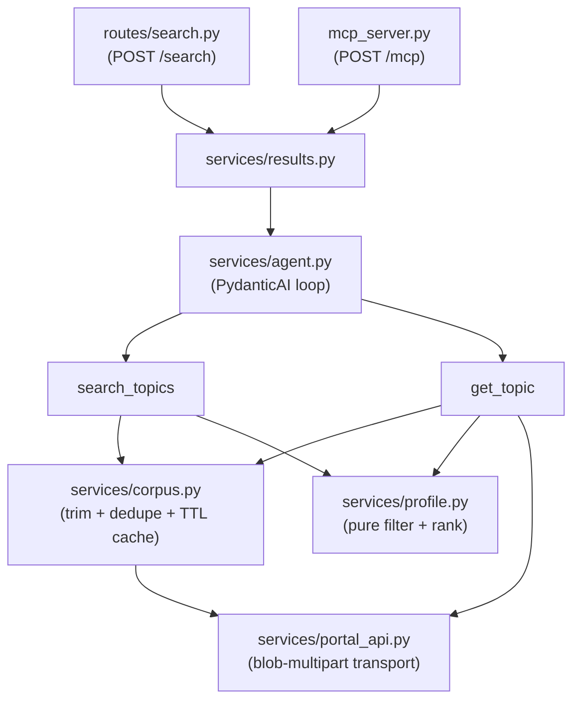

# Repository Guidelines

## Project Overview

An AarhusAI agentic tool over the [EU Funding & Tenders Portal][portal]. It fetches call topics from
the Portal's SEDIA search API, lets a user chat about them, and accepts a **search profile** that
filters and ranks topics.

Two public surfaces, one shared pipeline: `POST /search` (REST) and `POST /mcp` (MCP over Streamable
HTTP). Both funnel into `services/results.run_search`. Behaviour changes belong there or deeper —
never in a route.

Domain rules live in `README.md` and are load-bearing; the short version:

- **Profile fields** — `programmes`, `statuses`, `languages` are pushed server-side; `topic_contains`,
  `clusters`, `keywords` run client-side. The split is forced, not stylistic: the Portal DSL accepts
  only `bool`/`must`/`terms`, and `wildcard`/`match` return `400 businessError: "Invalid Query format"`.
- **`topic_contains` OR `clusters`** — never AND. AND returns almost nothing.
- **Ranking** — additive over *distinct* matched keywords: **2 points** for a hit in title/keywords/tags,
  **1 point** for a description-only hit (`_SCORE_METADATA`/`_SCORE_DESCRIPTION`, `app/services/profile.py:96-101`).
  Case-insensitive, word-boundary aware (`Cloud` ≠ `clouded`; `TRL 4-7` matches literally). Ties break
  on soonest deadline, then identifier.
- **Unknown programme/status → `warnings`**, never silently dropped.

## Architecture & Data Flow



Import graph is strictly one-way: `main → {auth, config, mcp_server, routes.search, portal_api}`,
`routes.search/mcp_server → results`, `results → {agent, profile}`, `agent → {corpus, portal_api, profile}`,
`corpus → portal_api`, `profile → {config, models}`. `portal_api` imports `profile.identifier_query`
*inside the function* (`app/services/portal_api.py:148-150`) purely to keep that direction acyclic — keep it there.

**Request flow.** Auth → `run_search` → `agent.handle` (PydanticAI loop under `asyncio.wait_for`) →
tools → `SearchResponse`. Tools write full records into `ctx.deps.full_results` and return only
300-char `_preview()` projections to the model (`app/services/agent.py:161-163`); `results.py` returns
the side channel, *not* what the LLM saw. Only the MCP path additionally `compact()`s
(`app/mcp_server.py:74`) — do not "unify" that with `/search`.

**The corpus.** Because identifier filtering is client-side, ranking must see every topic, not page 1.
The default profile is 970 rows over 10 sequential requests; page 1 contains zero MISS topics. So the
whole server-filtered set is fetched once, trimmed, deduped (970 rows → 888 unique identifiers) and
cached in **module-level dicts in the process heap**, keyed on `(canonical query JSON, languages tuple)`.
Consequences: a restart pays a ~10–20 s cold fetch, `--reload` drops it on every edit, and the container
**must** run a single uvicorn worker (`--workers` = N copies, N cold fetches).

## Key Directories

| Path | Purpose |
|---|---|
| `app/routes/` | Thin HTTP shells — auth dep, delegate, return. Zero business logic. |
| `app/services/` | All logic, one module per concern (`agent`, `corpus`, `portal_api`, `profile`, `results`). |
| `tests/` | Mirrors app top-level modules; `tests/services/` mirrors `app/services/` 1:1. |
| `tests/fixtures/` | Real trimmed Portal payloads (`portal_search_page.json`, `identifiers.json`). |
| `dev/mock-portal/` | Deliberately hostile fake SEDIA API — reproduces production's failure modes. |
| `dev/mock-llm/` | Fake OpenAI-compatible endpoint; `script.py` holds deterministic scenarios. |

## Development Commands

Everything runs **inside the container** via `docker compose exec agent` (`PYTHON` var, `Taskfile.yml:18`).
Never run `ruff`/`pytest` on the host. `lint`/`test`/`shell` all `exec`, so `task up` must have run first.

```bash
task up                 # docker compose up -d --build (builds the dev stage)
task down / task shell
task lint               # ruff check .
task lint:fix           # ruff check --fix . && ruff format .
task test               # pytest -v -p no:cacheprovider
task test:coverage      # pytest --cov=app --cov-report=term-missing  (fails under 100%)
task ci                 # lint + test — note: NOT coverage

task try:local          # --profile mock + dev/docker-compose.local.yml; fully offline
task try:local QUERY="cluster 5 energy calls"
task try:realapi        # --profile mockllm + live SEDIA Portal
task try:down / task try:realapi:down

task build:image TAG=x  # buildx multi-arch --target prod → ghcr.io/aarhusai/...
```

Single test: `docker compose exec agent pytest tests/services/test_profile.py::test_name -v`.

**`task try:realapi` is mandatory after touching `app/services/portal_api.py`** — only production can
prove the multipart encoding still works; the mock cannot.

`.claude/settings.json` allowlists exactly `task up|lint|lint:*|test|test:coverage|ci` (plus a
nonexistent `task logs`) and denies all read/write of `.env`.

## Code Conventions & Common Patterns

- **Layering.** Routes and the MCP tool parse/clamp arguments and delegate. New behaviour goes in
  `app/services/` so both surfaces get it.
- **Settings access.** Always `from app.config import settings`, read attributes *at call time* — never
  snapshot into a module constant. Tests monkeypatch `module.settings.<field>` and rely on this.
- **Lazy module-level singletons** with `global` rebinding for anything expensive: `_get_client`
  (`portal_api.py:28-37`), `_build_agent` (`agent.py:99-103`). Never construct at import time. Any new
  module-level client or cache MUST also be reset in `tests/conftest.py::_reset_state`.
- **Profile merging.** `overrides.merged_over(base)`; build overrides as a `SearchProfile(...)` of raw
  optional args and let `model_dump(exclude_none=True)` filter. Caller over `DEFAULT_PROFILE`, LLM tool
  args over the request profile.
- **Tools mutate `ctx.deps`, never module state** (`iterations`, `total_matched`, dedup-appended `warnings`).
- **Portal metadata is a dict of *lists*** — even scalars (`status` arrives as `["31094502"]`). Always go
  through `corpus._first` / `_all`; never index metadata directly. `actions`, `budgetOverview`, `links`,
  `latestInfos` are JSON documents encoded **as strings** inside a single-element list (unwrap + parse).
- **`profile.py` purity is a contract.** It may import only `re`, `app.config.settings`,
  `app.models.SearchProfile`. No httpx, no asyncio, no `time`, no LLM. This is what makes 100% coverage
  realistic.
- **Error handling.** `agent.handle()` never raises: timeout and any exception log and return partial
  `deps` (`agent.py:239-251`), so `/search` returns 200 with empty `results` on LLM failure.
  `portal_api.ping()` swallows only `httpx.HTTPError`.
- **Naming.** Private helpers `_`-prefixed; `log = logging.getLogger(__name__)` in every logging module;
  never `print`. PEP 604 unions, full annotations, keyword-only service args after `*`.
- **Validation is declarative** — `Field(min_length=…, ge=…, pattern=…)`. There are no
  `@field_validator`s; don't introduce one where a `Field` constraint works. MCP clamps imperatively
  (`mcp_server.py:57`) because its args bypass `SearchRequest`.
- **Docstrings carry the *why*** — measured numbers, failure modes, byte counts. Match that register; do
  not strip those comments as noise.
- **Mocks in `dev/` are deliberately hostile.** Never "fix" a mock to accept what the agent currently
  sends; the 500/400 behaviours are the contract.
- **Changelog.** Keep a Changelog 1.1.0 + SemVer; user-visible changes get a bullet under `## [Unreleased]`.

## Important Files

| File | Why it matters |
|---|---|
| `app/main.py` | App wiring. `app.mount("/", …)` **must stay last** (`:122`) or it shadows `/search` and `/health`. `mcp.session_manager.run()` in the lifespan is mandatory — Starlette does not run a mounted sub-app's lifespan. MCP auth is a raw-ASGI middleware, not `BaseHTTPMiddleware` (which would buffer and break SSE) and not `Depends` (unreachable in a mounted app). |
| `app/config.py` | `settings = Settings()` at import → fail-fast. `api_key` and `agent_api_key` are the only required fields. `agent_max_iterations` is declared but **never read**. |
| `app/services/portal_api.py` | `_blob()` must stay a multipart **file** part with filename + explicit `Content-Type: application/json`. As a form field → `500 {"type":"throwable"}`; in the URL → `query` is silently ignored and results come back unfiltered. `_best_row()` picks the richest row — never `results[0]`, because stub rows (no status, empty description) sort first. |
| `app/services/corpus.py` | Language MUST stay in the cache key or a `da` request is served the cached `en` corpus. TTL uses `time.monotonic()`, not wall clock. `invalidate()` is the only reset hook. |
| `app/services/profile.py` | The product: Portal id tables, `DEFAULT_PROFILE`, `DEFAULT_KEYWORDS` (43 entries), scoring, filtering. |
| `app/services/results.py` | `total_matched=max(deps.total_matched, len(results))` — `get_topic` appends to `full_results` without touching `total_matched`. |
| `tests/conftest.py` | The `os.environ[...]` block above the `app` imports. Moving it below breaks the entire suite. |
| `Taskfile.yml` | `dotenv` + `env:` fallbacks exist because base compose uses `${API_KEY:?}`, resolved at parse time — raw `docker compose` without go-task fails, even for `down`. |

## Runtime/Tooling Preferences

- **Python floor is 3.11** (`requires-python`, ruff `target-version = "py311"`) even though the image is
  `python:3.12-slim`. 3.12-only syntax runs but violates the contract.
- **Docker-mediated everything.** No virtualenv, no requirements.txt, no lock file. New runtime dep →
  `[project] dependencies`; new tool → `[project.optional-dependencies] dev`. `pyproject.toml` is
  bind-mounted **read-only**, so a dependency edit needs `task up` (rebuild), not a restart.
- **Pinned with reason — do not widen:** `pydantic-ai-slim[openai]>=2.0,<3` (<1.0 resolves to 0.8.1, which
  imports the removed `opentelemetry._events`) and `mcp[cli]>=2.0,<3` (2.x renamed `FastMCP` → `MCPServer`
  and moved `transport_security` onto `streamable_http_app()`). Rationale recorded in `CHANGELOG.md`.
- **Ruff**: line-length **99**, `select = ["E","W","F","I","UP","B","SIM","RUF"]`, `ignore = ["B008"]`
  (FastAPI `Depends` defaults), `known-first-party = ["app"]`. `dev/` is excluded — the mocks are unlinted.
- **Compose**: service name is always `agent`; a differently-named override silently *adds* a service.
  Profiles must be passed explicitly (`--profile mock` / `--profile mockllm`) — `depends_on` does not
  activate a profile. The external `frontend` network must exist; only the `try:*` tasks auto-create it.
- **New env var = three edits**: `.env.example`, `docker-compose.yml` `environment:` with `${VAR:-default}`,
  and the relevant `dev/docker-compose.*.yml`. JSON-array vars need valid JSON defaults.

## Testing & QA

pytest 8 + `pytest-asyncio` in `asyncio_mode = "auto"` (bare `async def test_…`, no marker) + `pytest-cov`
+ `respx`. Coverage gate is `fail_under = 100` in `pyproject.toml`, enforced only by `task test:coverage`
— `task ci` does not run it. There is no CI workflow; the gate is manual.

- **Mock at the two external edges only**: the Portal via `respx.post(PORTAL_URL)` (import `PORTAL_URL`
  from `tests.conftest`, never re-spell it), and the LLM via `pydantic_ai.models.function.FunctionModel`
  + `built.override(model=…)`. There is **no HTTP mock of the LiteLLM endpoint**; the base URL exists only
  so `Settings()` validates. `_build_agent()` is memoised, so `override` must wrap the `await handle(...)`.
- **Test names are full sentences** describing behaviour and reason
  (`test_a_stub_never_displaces_a_complete_row`), and docstrings record measured facts. Tests assert on
  private internals freely (`corpus._dedupe`, `agent._PREVIEW_CHARS`) — that is the convention here.
- **`tests/services/test_portal_api.py::test_query_and_languages_are_sent_as_json_file_parts` is
  load-bearing**: it decodes raw multipart bytes and asserts `filename="blob"` and two
  `Content-Type: application/json` parts. Do not simplify `_blob` or relax this test.
- MCP-transport tests must build their own client inside `async with lifespan(app)`; the shared `client`
  fixture does not run the lifespan, and the transport raises "Task group is not initialized" without it.
- Corpus caching means one respx route serves many logical calls — assertions use `route.call_count`.
  Adding an unmocked Portal call to app code turns these into silent failures.
- `tests/` and `tests/services/` both need their `__init__.py` for `from tests.conftest import …` to resolve.

[portal]: https://ec.europa.eu/info/funding-tenders/opportunities/portal/screen/home
