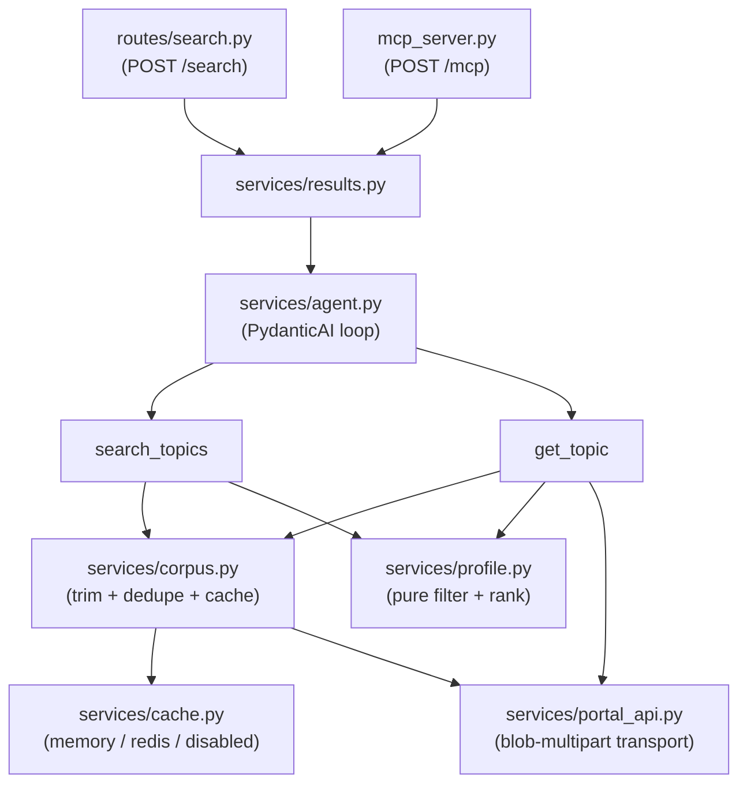

# EU Funding & Tenders Portal Agent

An AarhusAI agentic tool over the [EU Funding & Tenders Portal][portal]. It retrieves call topics
from the Portal's search API, lets a user chat about them, and accepts a **search profile** in the
request that filters and ranks topics.

Exposed both as a REST endpoint (`POST /search`) and as an MCP tool over Streamable HTTP
(`POST /mcp`), so it can be used from a chat client such as OpenWebUI.

> **There is no official Portal API.** The Portal publishes no documented, versioned API for call
> topics. What this agent talks to is the **SEDIA search API the Portal's own web frontend calls** —
> found by watching that frontend's network traffic and reproducing its requests. It is public and
> needs no credentials (`apiKey=SEDIA` is a literal the frontend sends, not a secret), but nothing
> about it is promised to us: the endpoint, the query grammar, the field names and the numeric
> taxonomy ids can all change without notice, and the day they do this agent breaks. That risk is
> accepted deliberately — the alternative is no machine access at all. `task try:realapi` runs the
> real request against production for exactly this reason, and is the first thing to run when
> something looks wrong. The behaviours we had to discover are written down under
> [The Portal API](#the-portal-api).

## Purpose

- Retrieve information from the Portal through its API.
- Make it possible to chat about that information.
- Accept a search profile that searches for specific categories, and rank the results.

### Ask it things like

Paste these into a chat client pointed at `/mcp`, or send them as the `query` field to `/search`:

- *"Which calls fit a smart-city IoT dataspace pilot?"*
- *"What's open right now in cluster 5 on energy, and when are the deadlines?"*
- *"Any mission (MISS) topics on climate adaptation for a local authority?"*
- *"Compare the two closest deadlines — what would we actually have to deliver?"*

The answers are useful because of the **search profile**: it has already narrowed thousands of
topics down to the ones your organisation could plausibly bid on, and ranked them. Ask the same
question against the raw Portal and you get a list you would still have to read end to end.

## The search profile

**A profile is a standing description of what your organisation is looking for.** The Portal carries
thousands of call topics; an Aarhus municipality team can realistically act on a handful. Rather than
make someone re-specify that filter on every question, you write it down once — which programmes,
which statuses, which parts of the Portal's topic taxonomy, and which subject keywords matter — and
send it with each request.

It does two jobs at once:

1. **Constrains** what is retrieved, so the agent never considers topics you could not bid on
   (wrong programme, already closed, wrong policy area).
2. **Orders** what comes back, so the most relevant topics are first and each one carries a score
   explaining why.

The practical effect: *"which calls fit a smart-city IoT pilot?"* returns a ranked shortlist you can
read, instead of everything the Portal happens to match. Every field is optional; anything unset
falls back to the default profile, which encodes the example from the original brief:

| Field | Meaning | Applied |
|---|---|---|
| `programmes` | Framework programmes, e.g. `["Horizon Europe", "Digital Europe"]` | server-side |
| `statuses` | Submission statuses, default `["Forthcoming", "Open for submission"]` | server-side |
| `languages` | Which language copy of each topic to fetch, default `["en"]` | server-side |
| `topic_contains` | Substrings in the topic identifier, e.g. `["MISS"]` | client-side |
| `clusters` | Cluster codes in the identifier, e.g. `["CL2","CL4","CL5"]` | client-side |
| `keywords` | Keywords that additively boost a topic's score | client-side |

### `topic_contains` and `clusters`: filtering on the topic identifier

Both filter on the **topic identifier**, the code the Portal gives every call topic. It is
structured, so you can read a topic's subject area straight off it:

```
HORIZON-CL5-2027-07-D3-16
└─────┘ └─┘ └──┘ └┘ └──┘
   │     │    │   │    └── topic number
   │     │    │   └─────── destination within the cluster
   │     │    └─────────── year (and call round)
   │     └──────────────── cluster 5
   └────────────────────── programme
```

**`clusters`** matches those `CLx` codes. Under Horizon Europe, a cluster is a thematic pillar; the
three in the default profile are the ones a municipality tends to be eligible for:

| Code | Cluster |
|---|---|
| `CL2` | Culture, Creativity and Inclusive Society |
| `CL4` | Digital, Industry and Space |
| `CL5` | Climate, Energy and Mobility |

**`topic_contains`** is the escape hatch for anything the cluster codes do not capture: it matches a
plain substring anywhere in the identifier. The default profile uses it for `MISS` — the EU
**Missions** topics (climate adaptation, climate-neutral cities, soil, oceans, cancer), which carry
`MISS` in the identifier instead of a cluster code and would otherwise be missed entirely.

The two are **OR**-ed: the default profile means "topics with MISS in the identifier *or* in cluster
2, 4 or 5". Reading it as AND would return almost nothing, since a topic is one or the other.

The split between server-side and client-side is not a design preference. The Portal's query DSL
accepts only `bool`/`must`/`terms` — `wildcard` and `match` are rejected with
`400 businessError: "Invalid Query format"` — so no substring match on an identifier can be pushed
upstream.

### Ranking

Filtering is not enough on its own. Even after the programme, status and identifier rules, the
default profile still matches hundreds of topics — and nobody reads hundreds of call descriptions.
Something has to decide which ten go in front of a human, and that is what ranking does: it turns
"here is everything that qualifies" into "start with these".

The scheme is deliberately simple and **explainable**. Every result carries its `score` and the
exact `matched_keywords` that produced it, so a colleague asking "why is this one first?" gets an
answer, and a profile that is ranking the wrong things can be diagnosed by looking at which keywords
actually fired. A black-box relevance score would be shorter to write and impossible to argue with.

Score is additive over the distinct keywords a topic matches:

- **2 points** for a hit in the title, keywords or tags.
- **1 point** for a hit only in the description.

The weighting is measured, not guessed: across the 970-topic English corpus "Cloud" appears in 26
topics' metadata and 44 *more* only in the description, so scoring them equally would let incidental
prose outrank a topic that is genuinely about the keyword. Matching is case-insensitive and
word-boundary aware, so `Cloud` does not match `clouded` and `TRL 4-7` / `Web 4.0` match literally.

Ties break on the soonest deadline, then the identifier for a stable order. Every result carries its
`score` and `matched_keywords` so the ordering can be explained rather than taken on trust.

## Usage

```bash
curl -X POST http://localhost:8000/search \
  -H "Authorization: Bearer $API_KEY" \
  -H 'Content-Type: application/json' \
  -d '{"query": "Which calls fit a smart-city IoT dataspace pilot?"}'
```

With an explicit profile:

```json
{
  "query": "cluster 5 energy calls",
  "max_results": 20,
  "profile": {
    "clusters": ["CL5"],
    "topic_contains": [],
    "keywords": ["Smart Grid", "Smart Energy", "Dataspace"]
  }
}
```

The response carries `results`, `total_matched` (matches before `max_results` truncation),
`profile_used`, `iterations` and `warnings`. A profile naming an unknown programme or status is
reported in `warnings` rather than silently ignored — quietly dropping a typo would widen the search
while appearing to narrow it.

## How it works



`services/profile.py` holds the filtering and ranking rules — the part of this service that decides
which topics a caller sees and in what order. Everything else is transport, caching and plumbing
around it. It is also the only module that is **pure**: no network, no LLM, no clock. It takes
trimmed topic dicts plus a profile and returns filtered, scored topics, so its behaviour is fully
reproducible and can be tested exhaustively rather than sampled — which is what makes the 100%
coverage target realistic.

The agent's tools push full records into a per-request side channel and return only truncated
previews to the model, so the descriptions the caller receives never consume the model's token
budget.

### The topic corpus

Because identifier filtering must happen client-side, ranking is only honest if it sees *every*
topic rather than the first relevance-ordered page. The default profile is 970 rows across 10
requests; page 1 of 100 contains **zero** MISS topics, so a page-per-request design would make the
default profile look broken.

So the agent fetches the whole server-filtered set once, trims it, dedupes it and caches it. The raw
payload is 20.8 MB, but 36% of that is HTML the product never reads (`topicConditions`,
`supportInfo`), leaving roughly 1 MB of metadata plus the plain-text descriptions ranking needs.

#### Where the cache lives

`CACHE_BACKEND` picks one of three, keyed on `(query, languages)` in both cases that store anything:

| Backend | Behaviour | Use when |
|---|---|---|
| `memory` *(default)* | Process heap. No infrastructure, nothing on disk, nothing shared. | Single container, dev, tests. |
| `redis` | One shared copy in Redis at `CACHE_REDIS_URL`, written with `SETEX` at `PORTAL_CACHE_TTL`. | More than one instance, or restarts frequent enough that the cold fetch hurts. |
| `disabled` | Every search refetches. | Debugging the Portal path. |

With `memory`:

- A restart or redeploy drops it; the next request pays the cold fetch (~10–20 s).
- The dev container runs `uvicorn --reload`, so every code edit drops it too.
- It is **per worker**, which is why the container runs a single uvicorn process. Adding `--workers`
  would give each worker its own copy — N times the memory and N cold-start fetches. If you need
  multiple workers or replicas, that is the point at which to switch to `redis`.

With `redis` (`task up:redis` runs it locally):

- The corpus outlives the container, so a redeploy costs nothing and only the *first* instance in a
  fleet pays the cold fetch.
- **A Redis outage never fails a search.** The backend fails open: an unreachable or slow Redis is
  treated as a cache miss, logged as a warning, and the search refetches from the Portal. Slow, not
  broken. For this reason `/health/ready` deliberately does not probe Redis — a cache being down is
  not a reason to take the service out of rotation.
- Keys are versioned (`corpus:v1:<sha256>`). When the shape of a cached topic changes, bump
  `_NAMESPACE_VERSION` in `services/cache.py` rather than flushing Redis: old and new instances then
  simply read different keys instead of one deserialising the other's rows.
- **Sizing.** One corpus entry measured 4.2 MB in Redis (972 topics, default profile, `en`), so the
  container's 256 MB `maxmemory` holds ~60 distinct profile/language combinations, with
  `allkeys-lru` evicting the coldest rather than refusing writes. Measured cold vs. warm against the
  live Portal: **11.2 s → 0.02 s**.

The backend abstraction is lifted from the sibling [`AarhusAI/search-agent`][search-agent], so the
two services cache the same way and the code is recognisable across both.

`/health/ready` is a deliberately cheap `pageSize=1` probe and does **not** warm the cache.

### Languages

**`PORTAL_LANGUAGES` is not a translation setting, and it is not how you get Danish answers.** The
LLM handles translation; the request's `language` field is the hint that drives it. Two separate
things:

| Setting | Controls |
|---|---|
| `language` (request field) | Which language the agent **answers** in. This is the one you usually want. |
| `PORTAL_LANGUAGES` / `profile.languages` | Which **language copy of each record** is pulled out of the Portal's index. |

So `PORTAL_LANGUAGES` changes *which rows exist to be searched and ranked*, nothing else. Two
consequences, both arguments for leaving it at `["en"]`:

- **Coverage varies a lot.** For the default profile: `en` 970 topics, `da` 536, `fr` 532, `de` 526.
  Setting it to `["da"]` does not translate the corpus — it discards 45% of it. A list acts as a
  preference order with per-topic fallback, so `["da","en"]` yields Danish where it exists and
  English otherwise, which at least avoids the coverage loss.
- **The copies are not really translated anyway.** On the topic we sampled, the Danish record had a
  title identical to the English one and a body in plain English. The ranking keywords are English
  too, so a non-English corpus scores worse against the same profile.

In short: to read results in Danish, set `language: "da"` on the request and leave the corpus in
English. Reach for `PORTAL_LANGUAGES` only if you specifically need the Portal's own Danish records.

## Configuration

All settings come from the environment. Fields without a default are required and fail fast at
import, so the service refuses to start misconfigured rather than failing later.

| Variable | Default | Notes |
|---|---|---|
| `API_KEY` | — | **required.** Bearer token clients must send |
| `AGENT_API_KEY` | — | **required.** This agent → LiteLLM |
| `AGENT_MODEL` | `gpt-4o-mini` | model name passed to LiteLLM |
| `AGENT_API_BASE_URL` | `http://litellm:4000/v1` | OpenAI-compatible gateway |
| `AGENT_TIMEOUT` | `60` | seconds for the whole agent run |
| `AGENT_MAX_ITERATIONS` | `8` | tool calls per query before the run is cut short |
| `AGENT_SYSTEM_PROMPT` | *(built-in)* | replaces the prompt **wholesale** — see the note below |
| `AGENT_MAX_RESULTS` | `10` | default page size for `/search` and the MCP tool |
| `AGENT_MAX_RESULTS_CAP` | `50` | hard ceiling both clamp to |
| `AGENT_PREVIEW_CHARS` | `300` | description chars the LLM sees per topic |
| `MCP_MAX_DESCRIPTION_CHARS` | `400` | MCP-only: description budget per topic |
| `MCP_MAX_KEYWORDS` | `10` | MCP-only: cap on keywords and tags per topic |
| `PORTAL_SEARCH_URL` | the public SEDIA endpoint | |
| `PORTAL_API_KEY` | `SEDIA` | public; the literal key the portal frontend uses |
| `PORTAL_PROGRAMME_IDS` | `{}` | JSON object, `name → id`, merged over the built-ins |
| `PORTAL_STATUS_IDS` | `{}` | JSON object, `name → id`, merged over the built-ins |
| `PORTAL_LANGUAGES` | `["en"]` | JSON array |
| `PORTAL_PAGE_SIZE` | `100` | |
| `PORTAL_MAX_PAGES` | `20` | pagination safety cap; truncation is logged |
| `PORTAL_TIMEOUT` | `30` | seconds per Portal request |
| `PORTAL_CACHE_TTL` | `21600` | 6h; topics change daily at most |
| `CACHE_BACKEND` | `memory` | `memory`, `redis` or `disabled` |
| `CACHE_REDIS_URL` | `redis://redis:6379/0` | used only when `CACHE_BACKEND=redis` |
| `MCP_ALLOWED_HOSTS` | `["eu-funding-tenders-portal-agent:*","localhost:*"]` | Host allowlist for `/mcp` |
| `DEBUG` | `false` | |

**What is `SEDIA`?** The **Single Electronic Data Interchange Area** — the European Commission's
platform behind the Funding & Tenders Portal. It shows up twice: in the search URL path, and as the
literal value of `PORTAL_API_KEY`. That "key" is not a credential and is not ours: it is a fixed
public identifier the Portal's own frontend sends with every search, so it is checked into this repo
as a default and needs no secret handling.

**Two independent limits bound a run.** `AGENT_TIMEOUT` is wall clock; `AGENT_MAX_ITERATIONS` is a
tool-call budget (PydanticAI `UsageLimits`), there to stop a model that keeps searching instead of
answering. Hitting either is not an error: the tools have already written their results to the
response, so the caller still gets topics — just without the model's closing summary.

**Overriding the system prompt.** `AGENT_SYSTEM_PROMPT` replaces the built-in prompt entirely, not
partially. The default (`app/services/agent.py`) carries the tool-calling workflow, so an override
that omits it will stop the agent calling `search_topics` and it will answer from nothing. Start
from the default text and edit it.

**Adding a programme or status.** The Portal's numeric taxonomy ids are verified constants in
`app/services/profile.py`; they do not change once published, but the EU does publish new
programmes. Rather than wait for a release, set e.g.
`PORTAL_PROGRAMME_IDS={"Creative Europe":"12345678"}` and it merges over the built-ins (names are
matched case-insensitively, so this can also correct an existing entry). To find an id: filter by
that programme on the Portal's search page and read the `frameworkProgramme` value off the
search-api request in your browser's network tab.

## Development

The project uses [Go Task](https://taskfile.dev). Run `task` with no arguments for the authoritative
list of what is available; the summary below is the short version:

```bash
task up               # start the dev container (--reload)
task up:redis         # ...plus Redis, with CACHE_BACKEND=redis
task shell            # shell into it
task test             # pytest
task test:coverage    # pytest --cov (fails under 100%)
task lint             # ruff check
task lint:fix         # ruff fix + format
task ci               # lint + test

task try:local        # full stack on mocks — no network, no credentials
task try:realapi      # live Portal + mock LLM: proves the encoding against production
task try:down         # tear down

task build:image TAG=x  # multi-arch build & push to ghcr.io
```

Everything runs **inside the container** — `lint`, `test` and `shell` all `docker compose exec`, so
`task up` has to have run first. Don't run `ruff` or `pytest` on the host.

Run a single test inside the container: `pytest tests/services/test_profile.py::test_name`.

`task try:realapi` is the one that matters after touching `services/portal_api.py` — the mock cannot
prove the request encoding is still accepted by production.

## The Portal API

Because the API is undocumented (see the note at the top), everything below had to be discovered by
trial against production. Each item is a case where the *natural* implementation silently fails or
quietly returns wrong data — so they are recorded here to stop the next person rediscovering them,
and to show what "unofficial" costs in practice. The maintenance rules that follow from them live in
`CLAUDE.md`; this section is the evidence.

**Endpoint** — `POST https://api.tech.ec.europa.eu/search-api/prod/rest/search`, with
`apiKey=SEDIA`, `text=***` (the "no free-text term" wildcard), `pageSize`, `pageNumber`.

**`query` and `languages` must be multipart _file_ parts**, each with a filename and an explicit
`Content-Type: application/json` — this mirrors the portal frontend, which posts them as
`FormData(Blob)`. Sent as ordinary form fields the API returns `500 {"type":"throwable"}`; passed in
the URL, `query` is accepted and then **silently ignored**, so the call appears to work while
returning unfiltered results. `dev/mock-portal` reproduces both failures on purpose, and a test
asserts on the bytes we send.

**Verified filter values**

| Field | Values |
|---|---|
| `type` | `1` = call topic |
| `status` | `31094501` Forthcoming · `31094502` Open for submission · `31094503` Closed |
| `frameworkProgramme` | `43108390` HORIZON · `43152860` DIGITAL · `43332642` EU4H |

Extend these without a release via `PORTAL_PROGRAMME_IDS` / `PORTAL_STATUS_IDS` — see Configuration.

**Response shape** — `metadata` is a dict of *lists*: every value is an array, even conceptually
scalar ones (`status` arrives as `["31094502"]`). `actions`, `budgetOverview`, `links` and
`latestInfos` are JSON documents encoded **as strings** inside a single-element list, so reading them
takes an unwrap plus a parse. Not every key is present on every row (`destination*` is on 82 of 100).

**`keywords` has two shapes, and the second one is a trap.** Usually it is a plain list of strings.
On some rows it is a *single-element* list whose one element is a JSON array encoded as text — the
same trick as `actions` above, but on a field that looks like an ordinary list, so it does not
announce itself. 3 of the 9 rows in our fixture are the encoded shape. Unparsed, the caller receives
one ~1 KB escaped string where the API promises `list[str]`, and any `keywords[:n]` cap silently does
nothing because the list is already length 1. Ranking hides the problem — substring matching finds
the terms inside the blob either way. `corpus._keywords()` normalises both shapes.

**Deduplication is required.** Even a single-language fetch repeats topics: 970 rows carry only 888
unique identifiers. Requesting two languages is purely additive — `["en","da"]` returns
970 + 536 = 1506 rows — and a mixed page comes back relevance-ordered, not in the order the languages
were requested.

**Some rows are stubs.** One identifier can map to several documents. For
`HORIZON-CL5-2024-D6-01-05` an identifier-only query returned 5 rows for `en`, and the row that
sorted *first* had no status, no deadline and an empty description. Hence `type` is pinned to call
topic on lookup and the richest row is chosen — never `results[0]`.

**There is no working per-topic detail endpoint.** `topicDetails/<identifier>.json` returns 404 for
every identifier tried, and the result's `url` field points at the human-facing portal page, not
JSON. Depth comes from a `terms`-on-identifier search instead — the search hit already carries
`actions`, `budgetOverview` and the description.

## References

For orientation if you are new to this service or comparing it with its siblings. (The rules for
*editing* the code are in `CLAUDE.md`; this list is for a human getting their bearings.)

- [AarhusAI agentic-tool guide](https://aarhusai.github.io/documentation/technical/agentic_tool.html)
  — the conventions every agent in this family follows.
- [retrieval-agent](https://github.com/AarhusAI/retrieval-agent) — the reference implementation this
  service was scaffolded from.
- [search-agent][search-agent] — source of the pluggable cache backend in `services/cache.py`; worth
  reading side by side if you touch caching here.
- Siblings: [eventdatabasen-agent](https://github.com/aarhusai/eventdatabasen-agent) and
  [retsinformation-api-agent](https://github.com/aarhusai/retsinformation-api-agent).
- [EU Funding & Tenders Portal][portal] — the site whose search API this wraps.

[portal]: https://ec.europa.eu/info/funding-tenders/opportunities/portal/screen/home
[search-agent]: https://github.com/AarhusAI/search-agent
