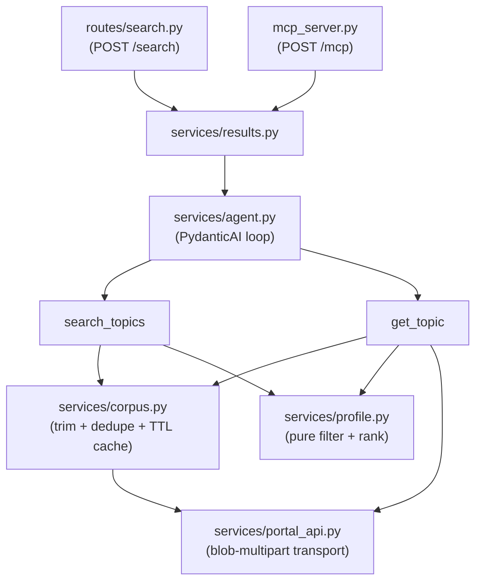

# EU Funding & Tenders Portal Agent

An AarhusAI agentic tool over the [EU Funding & Tenders Portal][portal]. It retrieves call topics
from the Portal's search API, lets a user chat about them, and accepts a **search profile** in the
request that filters and ranks topics.

Exposed both as a REST endpoint (`POST /search`) and as an MCP tool over Streamable HTTP
(`POST /mcp`), so it can be used from a chat client such as OpenWebUI.

## Purpose

- Retrieve information from the Portal through its API.
- Make it possible to chat about that information.
- Accept a search profile that searches for specific categories, and rank the results.

## The search profile

@TODO: explain what profiles are? I do not understand them and what they are used for?

A profile both constrains what is retrieved and orders what comes back. Every field is optional;
anything unset falls back to the default profile, which encodes the example from the original
brief:

| Field | Meaning | Applied |
|---|---|---|
| `programmes` | Framework programmes, e.g. `["Horizon Europe", "Digital Europe"]` | server-side |
| `statuses` | Submission statuses, default `["Forthcoming", "Open for submission"]` | server-side |
| `languages` | Which language copy of each topic to fetch, default `["en"]` | server-side |
| `topic_contains` | Substrings in the topic identifier, e.g. `["MISS"]` | client-side |
| `clusters` | Cluster codes in the identifier, e.g. `["CL2","CL4","CL5"]` | client-side |
| `keywords` | Keywords that additively boost a topic's score | client-side |


@TODO: I do not understand topic_contains and clusters what do they do and what are they used for "CLX"?

`topic_contains` and `clusters` are **OR**-ed: the default profile means "topics with MISS in the
identifier *or* in cluster 2, 4 or 5". Reading it as AND would return almost nothing.

The split between server-side and client-side is not a design preference. The Portal's query DSL
accepts only `bool`/`must`/`terms` — `wildcard` and `match` are rejected with
`400 businessError: "Invalid Query format"` — so no substring match on an identifier can be pushed
upstream.

### Ranking

@TODO: Why is this relevant and what is it used for?

Score is additive over the distinct keywords a topic matches:

- **2 points** for a hit in the title, keywords or tags.
- **1 point** for a hit only in the description.

The weighting is measured, not guessed: across the 970-topic English corpus "Cloud" appears in 26
topics' metadata and 44 *more* only in the description, so scoring them equally would let incidental
prose outrank a topic that is genuinely about the keyword. Matching is case-insensitive and
word-boundary aware, so `Cloud` does not match `clouded` and `TRL 4-7` / `Web 4.0` match literally.

Ties break on the soonest deadline, then the identifier for a stable order. Every result carries its
`score` and `matched_keywords` so the ordering can be explained rather than taken on trust.

## Usage

```bash
curl -X POST http://localhost:8000/search \
  -H "Authorization: Bearer $API_KEY" \
  -H 'Content-Type: application/json' \
  -d '{"query": "Which calls fit a smart-city IoT dataspace pilot?"}'
```

With an explicit profile:

```json
{
  "query": "cluster 5 energy calls",
  "max_results": 20,
  "profile": {
    "clusters": ["CL5"],
    "topic_contains": [],
    "keywords": ["Smart Grid", "Smart Energy", "Dataspace"]
  }
}
```

The response carries `results`, `total_matched` (matches before `max_results` truncation),
`profile_used`, `iterations` and `warnings`. A profile naming an unknown program or status is
reported in `warnings` rather than silently ignored — quietly dropping a typo would widen the search
while appearing to narrow it.

## How it works



@TODO: Is the product???

`services/profile.py` is the product and is deliberately pure — no network, no LLM, no clock. It
takes trimmed topic dicts plus a profile and returns filtered, scored topics, which is what makes
the 100% coverage target realistic.

The agent's tools push full records into a per-request side channel and return only truncated
previews to the model, so the descriptions the caller receives never consume the model's token
budget.

### The topic corpus

Because identifier filtering must happen client-side, ranking is only honest if it sees *every*
topic rather than the first relevance-ordered page. The default profile is 970 rows across 10
requests; page 1 of 100 contains **zero** MISS topics, so a page-per-request design would make the
default profile look broken.

So the agent fetches the whole server-filtered set once, trims it, dedupes it and caches it. The raw
payload is 20.8 MB, but 36% of that is HTML the product never reads (`topicConditions`,
`supportInfo`), leaving roughly 1 MB of metadata plus the plain-text descriptions ranking needs.

**The cache lives in the process heap** — module-level dicts in `services/corpus.py`, keyed on
`(query, languages)`. Nothing is written to disk and there is no shared store. It survives across
requests within one process and nothing else:

@TODO: Maybe use Redis as cache or local file storage, as it will be reset and maybe run more
       than one instances in prod setups.

- A restart or redeploy drops it; the next request pays the cold fetch (~10–20 s).
- The dev container runs `uvicorn --reload`, so every code edit drops it too.
- It is **per worker**, which is why the container runs a single uvicorn process. Adding `--workers`
  would give each worker its own copy — N times the memory and N cold-start fetches.
- `/health/ready` is a deliberately cheap `pageSize=1` probe and does **not** warm the cache.

### Languages

`PORTAL_LANGUAGES` selects which language copy of each topic is retrieved, and a request can
override it per call. Two things to know before changing it from `["en"]`:

@TODO: Is language not obsolete, the LLM will just translate it to the desired language? 

- **Coverage varies a lot.** For the default profile: `en` 970 topics, `da` 536, `fr` 532, `de` 526.
  A list acts as a preference order with per-topic fallback, so `["da","en"]` yields Danish where it
  exists and English otherwise.
- **The copies are not really translated.** On the topic we sampled, the Danish record had a title
  identical to the English one and a body in plain English. Since the ranking keywords are English
  too, pointing the corpus at another language mostly shrinks coverage without translating anything.

Note that `profile.languages` (which language copy to *fetch*) is distinct from the request's
`language` field (a hint for which language the agent should *answer* in).

## Configuration

All settings come from the environment. Fields without a default are required and fail fast at
import, so the service refuses to start misconfigured rather than failing later.

| Variable | Default | Notes |
|---|---|---|
| `API_KEY` | — | **required.** Bearer token clients must send |
| `AGENT_API_KEY` | — | **required.** This agent → LiteLLM |
| `AGENT_MODEL` | `gpt-4o-mini` | model name passed to LiteLLM |
| `AGENT_API_BASE_URL` | `http://litellm:4000/v1` | OpenAI-compatible gateway |
| `AGENT_TIMEOUT` | `60` | seconds for the whole agent run |
| `PORTAL_SEARCH_URL` | the public SEDIA endpoint | |
| `PORTAL_API_KEY` | `SEDIA` | public; the literal key the portal frontend uses |
| `PORTAL_LANGUAGES` | `["en"]` | JSON array |
| `PORTAL_PAGE_SIZE` | `100` | |
| `PORTAL_MAX_PAGES` | `20` | pagination safety cap; truncation is logged |
| `PORTAL_TIMEOUT` | `30` | seconds per Portal request |
| `PORTAL_CACHE_TTL` | `21600` | 6h; topics change daily at most |
| `MCP_ALLOWED_HOSTS` | `["eu-funding-tenders-portal-agent:*","localhost:*"]` | Host allowlist for `/mcp` |
| `DEBUG` | `false` | |

@TODO: `SEDIA` in PORTAL_SEARCH_URL what is that?

## Development

@TODO: write that we use task and that you can run `task` to get list of commands?

Run a single test inside the container: `pytest tests/services/test_profile.py::test_name`.

`task try:realapi` is the one that matters after touching `services/portal_api.py` — the mock cannot
prove the request encoding is still accepted by production.

## The Portal API

@TODO: What is this comment about? What fails and what is obvious?
@TODO: This seam to be something that should live in CLAUDE.MD. It does not make any sens?

Notes worth keeping, because the obvious implementation of each fails.

**Endpoint** — `POST https://api.tech.ec.europa.eu/search-api/prod/rest/search`, with
`apiKey=SEDIA`, `text=***` (the "no free-text term" wildcard), `pageSize`, `pageNumber`.

**`query` and `languages` must be multipart _file_ parts**, each with a filename and an explicit
`Content-Type: application/json` — this mirrors the portal frontend, which posts them as
`FormData(Blob)`. Sent as ordinary form fields the API returns `500 {"type":"throwable"}`; passed in
the URL, `query` is accepted and then **silently ignored**, so the call appears to work while
returning unfiltered results. `dev/mock-portal` reproduces both failures on purpose, and a test
asserts on the bytes we send.

**Verified filter values**

| Field | Values |
|---|---|
| `type` | `1` = call topic |
| `status` | `31094501` Forthcoming · `31094502` Open for submission · `31094503` Closed |
| `frameworkProgramme` | `43108390` HORIZON · `43152860` DIGITAL · `43332642` EU4H |

**Response shape** — `metadata` is a dict of *lists*: every value is an array, even conceptually
scalar ones (`status` arrives as `["31094502"]`). `actions`, `budgetOverview`, `links` and
`latestInfos` are JSON documents encoded **as strings** inside a single-element list, so reading them
takes an unwrap plus a parse. Not every key is present on every row (`destination*` is on 82 of 100).

**Deduplication is required.** Even a single-language fetch repeats topics: 970 rows carry only 888
unique identifiers. Requesting two languages is purely additive — `["en","da"]` returns
970 + 536 = 1506 rows — and a mixed page comes back relevance-ordered, not in the order the languages
were requested.

**Some rows are stubs.** One identifier can map to several documents. For
`HORIZON-CL5-2024-D6-01-05` an identifier-only query returned 5 rows for `en`, and the row that
sorted *first* had no status, no deadline and an empty description. Hence `type` is pinned to call
topic on lookup and the richest row is chosen — never `results[0]`.

**There is no working per-topic detail endpoint.** `topicDetails/<identifier>.json` returns 404 for
every identifier tried, and the result's `url` field points at the human-facing portal page, not
JSON. Depth comes from a `terms`-on-identifier search instead — the search hit already carries
`actions`, `budgetOverview` and the description.

## References

@TODO: why to different formats for links and are they relevant or is this something 
       that should live in CLAUDE.md 

- [AarhusAI agentic-tool guide](https://aarhusai.github.io/documentation/technical/agentic_tool.html)
- Reference implementation: <https://github.com/AarhusAI/retrieval-agent>
- Siblings: [eventdatabasen-agent](https://github.com/aarhusai/eventdatabasen-agent) ·
  [retsinformation-api-agent](https://github.com/aarhusai/retsinformation-api-agent)
- [EU Funding & Tenders Portal][portal]

[portal]: https://ec.europa.eu/info/funding-tenders/opportunities/portal/screen/home
